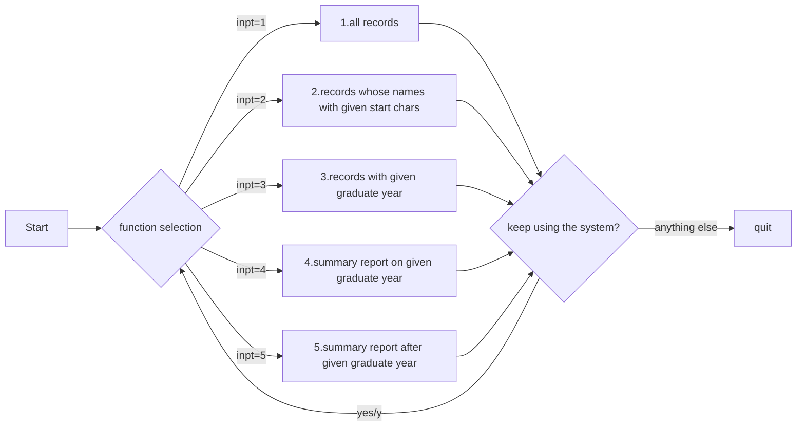

# Student Query Tool 
To read student records from a file and see some detail of it are the overall goal of this program. User can access to the whole data frame or part of it with certain criteria by simply inputting number of the function. Besides, the whole program is able to iterate, which allow user to generate several summary reports from the same data file  in one single process.   

## Background
SQT aim to help professors and teachers in reading data and producing some shot reports quickly. Besides, as a final group project of Programming with Python courses, SQT is showcase of what we have learnt in the Fall semester.  

The functions of this program is:

1. Display all student records;
2. Display students whose last name begins with a certain string (case insensitive);
3. Display all records for students whose graduating year is a certain year;
4. Display a summary report of number and percent of students in each program, for students grading on/after a certain year.

## Install
This program uses Pandas. Go check it out if you don't have it locally installed.
```python
pip install Pandas
```
## Usage
This program is to let the user enter queries to see a detail or summary report.

1. Pressing '1' to see all student records. Simply through Pandas' function of reading txt, we could simply access to data in file, and show them by printing it.
```python
if inpt == '1':
    print(df)
```

2. Pressing '2' to find correct name with given start chars of last name. Certain start chars are decided and inputted by the user. A 'for' loop is established here to iterate each last name in the 'Lastname' column. After matching them with the user's target chars, the program will collect them and show them to the user. If the user input nothing, no data will be returned. And the user will be asked whether she would like to run the program again.
```python
# input 2 for finding correct name with given start chars of lastname # function for finding correct name with given start chars of lastname
def Lastname(lastname):
    student = list()
    for i in range(1, len(df)+1):
        if df['Last'][i][:len(lastname)].lower() == lastname:
            student.append(df['Last'][i]+' '+df['First'][i])
    return student
```

3. Pressing '3' to filter all records by given graduate year. User will be asked to input the year them want to search. Then the program will search, match and pick each record in 'GradYear' column, and put them in a data frame. It will be printed and showed to the user. If the user not enters a number, no data will be returned. And the user will be asked whether she would like to keep using the system.
```python
# input 3 for filter all records by given gradyear
# function for filter all records by given gradyear
def Gradyear(year):
    result = df[df['GradYear'] == int(year)].reset_index().drop(columns = 'index')
    result.index = result.index + 1
    return result
```

4. Pressing '4' to make a short summary report on a certain graduate year. Like function 3, program will ask the user for the year they want. Beside gathering data as function 3 above, the program count the number and the percentage of students group by program as well. Show them in good format is necessary too. If the user not enters a number, no data will be returned. And the user will be asked whether she would like to keep using the system.
```python
# input 4 for summary report on a certain gradyear
# function for summary report on a certain gradyear
def Grad_on_year(year):
    df_grad_on_year = df_2.copy()
    df_grad_on_year = df_grad_on_year[df_grad_on_year['GradYear'] == int(year)][['DegreeProgram', 'Num of student', 'Percentage']].groupby('DegreeProgram').sum()
    # convert percentage from float to percent
    df_grad_on_year['Percentage'] = df_grad_on_year['Percentage'].apply(lambda x: format(x, '.2%'))
    # reset index
    df_grad_on_year = df_grad_on_year.reset_index()
    # set index start from 1
    df_grad_on_year.index = df_grad_on_year.index + 1
    return df_grad_on_year
```

5. Pressing '5' to summary report after a certain graduate year. More datas are included comparing with function 4. The filtering criteria becomes the records whose 'GradYear' larger than that the user inputs. Similar to function '4', records will be sum up by the group of program. The format showing to the user will be desirable too. If the user not enters a number, no data will be returned. And the user will be asked whether she would like to keep using the system.
```python
# input 5 for summary report after a certain gradyear
# function for summary report after a certain gradyear
def Grad_after_year(year):
    df_grad_after_year = df_2.copy()
    df_grad_after_year = df_grad_after_year[df_grad_after_year['GradYear'] > int(year)][['DegreeProgram', 'Num of student', 'Percentage']].groupby('DegreeProgram').sum()
    # convert percentage from float to percent
    df_grad_after_year['Percentage'] = df_grad_after_year['Percentage'].apply(lambda x: format(x, '.2%'))
    # reset index
    df_grad_after_year = df_grad_after_year.reset_index()
    # set index start from 1
    df_grad_after_year.index = df_grad_after_year.index + 1
    return df_grad_after_year
```

6. Whenever each function finishes, the system will ask the user if she would like to keep using it. Inputting 'yes' or 'y' the system will run again, while inputting others the system will quit.
```python
# ask if the user would like to keep using the system
decision = input('Do you like to try again? Enter Y/Yes to try again, enter something else to stop: ').lower()
if decision == 'y' or decision == 'yes':
    continue
else:
    print('Thanks for using the system, bye bye.')
t = False
```



## Contributors
Letao Li
Tianyi Hu
Haojia Li